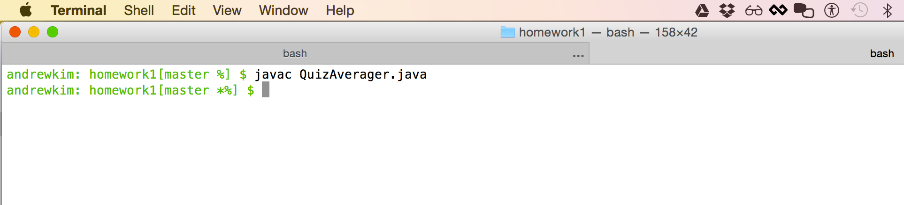
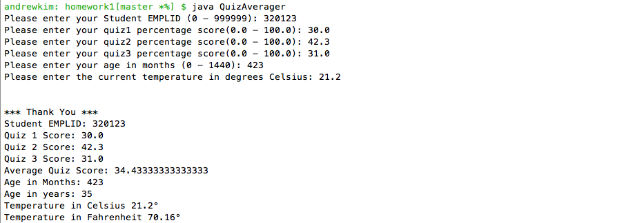
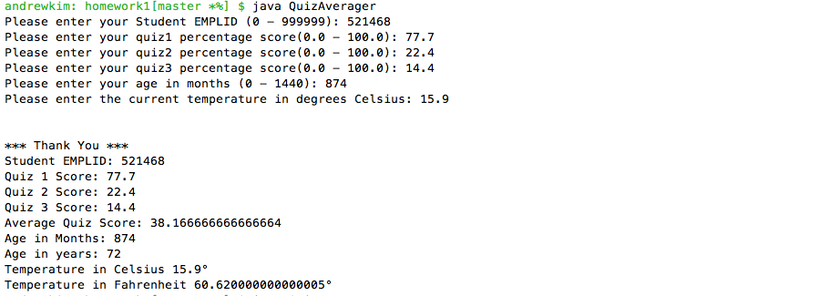
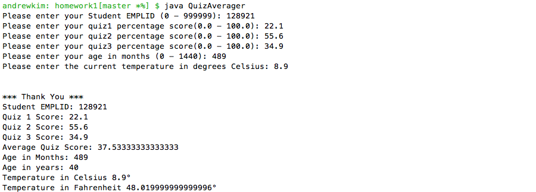

# Homework 1

Screenshot of Compilation:

## Test Cases
|Test Case #|Input |Expected Output | Actual Output|Passed?|
|----|----|----|----|----|
|1|EMPLID: 320123 Quiz1: 30.0 Quiz2: 42.3 Quiz3: 31.0 Age in months: 423 Temperature in Celcius: 21.2&deg;|\*\*\* Thank You \*\*\* Student EMPLID: 320123 Quiz1: 30.0 Quiz2: 42.3 Quiz3: 31.0 Average Quiz Score: 34.4333 Age in months: 423 Age in years: 35 Temperature in Celcius: 21.2&deg; Temperature in Fahrenheit: 70.16&deg;|\*\*\* Thank You \*\*\* Student EMPLID: 320123 Quiz1: 30.0 Quiz2: 42.3 Quiz3: 31.0 Average Quiz Score: 34.4333 Age in months: 423 Age in years: 35 Temperature in Celcius: 21.2&deg; Temperature in Fahrenheit: 70.16&deg;|yes|
|2|EMPLID: 521468 Quiz1: 77.7 Quiz2: 22.4 Quiz3: 14.4 Age in months: 874 Temperature in Celcius: 15.9&deg;|\*\*\* Thank You \*\*\* Student EMPLID: 521468 Quiz1: 77.7 Quiz2: 22.4 Quiz3: 14.4 Average Quiz Score: 38.1667 Age in months: 874 Age in years: 72 Temperature in Celcius: 15.9&deg; Temperature in Fahrenheit: 60.62&deg;|\*\*\* Thank You \*\*\* Student EMPLID: 521468 Quiz1: 77.7 Quiz2: 22.4 Quiz3: 14.4 Average Quiz Score: 38.1667 Age in months: 874 Age in years: 72 Temperature in Celcius: 15.9&deg; Temperature in Fahrenheit: 60.62&deg;| yes|
|3|EMPLID: 128921 Quiz1: 22.1 Quiz2: 55.6 Quiz3: 34.9 Age in months: 489 Temperature in Celcius: 8.9&deg;|\*\*\* Thank You \*\*\* Student EMPLID: 128921 Quiz1: 22.1 Quiz2: 55.6 Quiz3: 34.9 Average Quiz Score: 37.5333 Age in months: 489 Age in years: 40 Temperature in Celcius: 8.9&deg; Temperature in Fahrenheit: 48.02&deg;|\*\*\* Thank You \*\*\* Student EMPLID: 128921 Quiz1: 22.1 Quiz2: 55.6 Quiz3: 34.9 Average Quiz Score: 37.5333 Age in months: 489 Age in years: 40 Temperature in Celcius: 8.9&deg; Temperature in Fahrenheit: 48.02&deg;| yes|

## Test Case 1 Screenshot:

## Test Case 2 Screenshot:

## Test Case 3 Screenshot:

